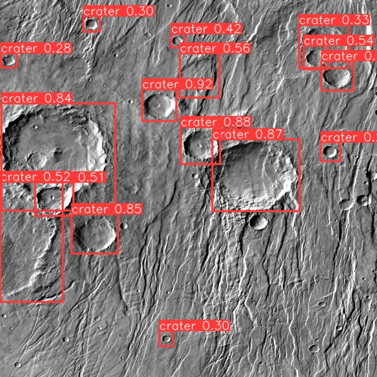

# Rock Greatest Hits

As it turns out, when you are planning a robotic exploration mission to the Moon or Mars, it is somewhat important to be able to identify the terrain slopes and obstacles, and if possible, to avoid landing on them. In particular, avoiding landing on a crater is a good idea, as it would likely be a bumpy ride otherwise.
Too bad that we at DIANA have no geological expertise whatsoever, and we are not even sure what a crater looks like. We have a hunch that it is a hole in the ground, but we are not sure. Can you help us?

Help our team and train a model able to reliably detect craters from orbital images of the Moon and Mars.

## Instructions

You find here an unsplitted dataset of orbital pictures from the Moon and Mars, with the corresponding labels indicating whether a crater is present in the image or not and where it is located in each image. Your task is to train a model able to predict whether one or more craters are present in a given image. You are **free to use any model architecture or technique** you see fit, as you are also free to augment the dataset as you prefer. If you have no idea where to start, feel free to look out on the internet for any available resource to make use of, but remember: *you should only look once* ;)

Keep in mind that your model will be evaluated against a secret test set.

## Expected deliverables
- The training script you used to train your model (e.g., a Jupyter notebook or a Python script)
- The best trained model you obtained (e.g., a .pt file)
- A prediction script that loads the trained model and predicts whether one or more craters are present in a given image
- (Optional), a brief report on the model you used, the training process, and the results you obtained, if you think it can help us understand your approach better

## Challenge's Score

Total Score: 300