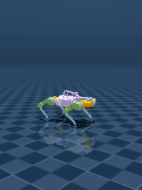

# Walk This Way

The DIANA Advanced AI Research & Guidance Hub (AARGH) is researching for a reason to justify its existence and its ever growing computing budget to IMPERIVM and to the Leader of the Computer Science Department. They've come out with the idea for a legged rover which could teoretically walk on much harsher terrains than the current wheeled rovers, and which will practically consist in quite a few years of job security for the AARGH team.

Being severly understaffed, the AARGH team has decided to outsource the development of the walking algorithm to you, confident that you will be able to come up with a solution that will make them look good in front of IMPERIVM and of the CS Leader.

## Instructions

You are given a Jupiter notebook with all the code you will need. Your task is train a Reinfocement Learning agent to walk a cute quadruped robot on a somewhat harsh terrain. Most of the code is already written for you, but you will need to fill in the blanks, mainly focusing on the training function, but feel free to tweak each other block of code as you see fit.

Your model will be evaluated on an unknown test terrain.

## Expected deliverables
- The modified notebook with the filled code blocks
- The trained model, saved as indicated in the notebook
- A .mp4 video of the trained model walking on the training terrain

## Challenge's Score

Total Score: 500